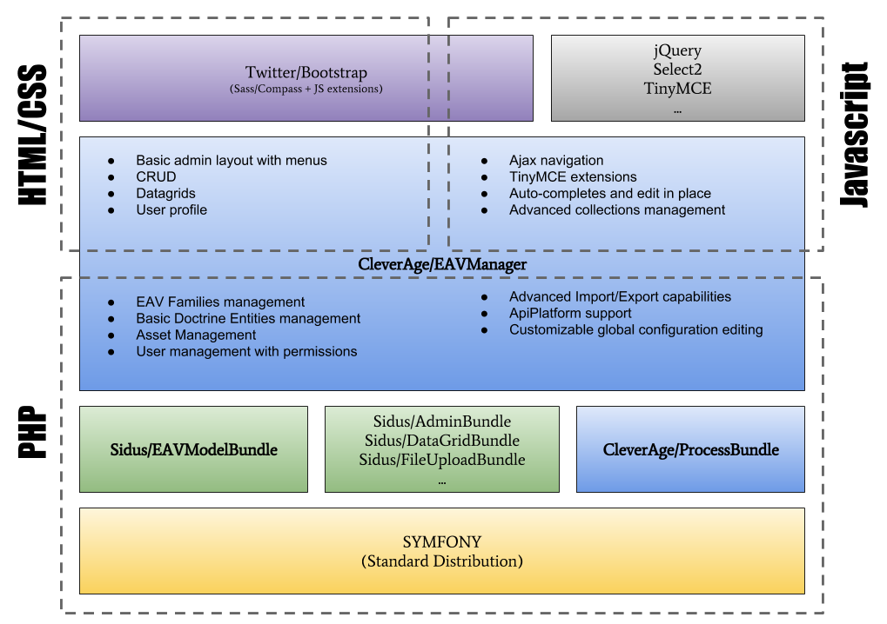

## Overview

## External Bundles

### Sidus/EAVModelBundle ###

Allows fast data modeling using a custom EAV model built upon Doctrine.
The model description is versioned in Yaml files instead of stored in the database along the actual data, this provides
less flexibility than a traditional EAV model for the end-user - as it's not directly editable using the user interface-,
but it does provide a significant gain in features, robustness and performances as well as being more customisable by
the developers.

[https://github.com/VincentChalnot/SidusEAVModelBundle](https://github.com/VincentChalnot/SidusEAVModelBundle)

#### Dependencies
- Doctrine: The EAV data uses Doctrine for storage and filtering

### Sidus/AdminBundle ###

The missing link between the controllers, the router component, the forms and the entities. 
Not an fully featured admin generator like Sonata!

[https://github.com/VincentChalnot/SidusAdminBundle](https://github.com/VincentChalnot/SidusAdminBundle)

#### Dependencies
- Sidus/DataGridBundle: Should'nt actually depend on it, work in progress

### Sidus/DataGridBundle ###

Adds datagrid capabilities upon the Sidus/FilterBundle.
Provides a basic Twitter/Bootstrap datagrid template but it's easily extendable.

[https://github.com/VincentChalnot/SidusDataGridBundle](https://github.com/VincentChalnot/SidusDataGridBundle)

#### Dependencies
- Sidus/FilterBundle: For filtering results

EAV compatibility is achieved with the help of the
[Sidus/EAVDataGridBundle](https://github.com/VincentChalnot/SidusEAVDataGridBundle) bundle

### Sidus/EAVBootstrapBundle ###

Provides a Twitter/Bootstrap integration through Mopa/BootstrapBundle and several new attribute types (autocomplete,
html, date pickers) and additional editing capabilities for "multiple" attributes.

[https://github.com/VincentChalnot/SidusDataGridBundle](https://github.com/VincentChalnot/SidusDataGridBundle)

#### Dependencies
- Sidus/EAVModelBundle: Extends it's capabilities
- Pinano/Select2Bundle: Select2 integration, used by autocomplete feature
- Stfalcon/TinymceBundle: TinyMCE integration for HTML attributes
- Mopa/BootstrapBundle: Twitter/Bootstrap integration (using SASS) with additional features
- jQuery, jQueryUI: For JS widgets

### Sidus/FilterBundle ###

Define filters on data source in configuration and helps build filter forms and pagination.

[https://github.com/VincentChalnot/SidusFilterBundle](https://github.com/VincentChalnot/SidusFilterBundle)

#### Dependencies
- Doctrine
- WhiteOctober/PagerFantaBundle

EAV compatibility is achieved with the help of the
[Sidus/EAVFilterBundle](https://github.com/VincentChalnot/SidusEAVFilterBundle) bundle

### Sidus/PublishingBundle ###

Forget it, it doesn't work anymore since the v1.2 and the switch from JMSSerializer to Symfony's Serializer component.
